# Hyperspace

**Audio-reactive video synthesis engine for CRT displays.**

Rust. wgpu. WGSL shaders. Lua scripting. Composite out to CRTs via Raspberry Pi.

## Shaders

<table>
<tr>
<td>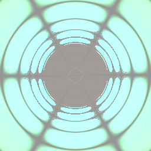<br><b>hyperspace_tunnel</b><br>Polar tunnel, stereo bend</td>
<td>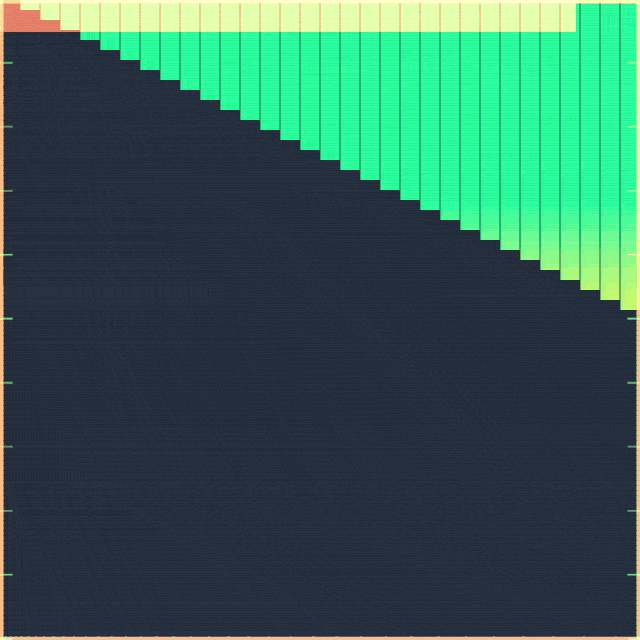<br><b>engine_gauges</b><br>Spectrum analyzer, CRT phosphor</td>
<td>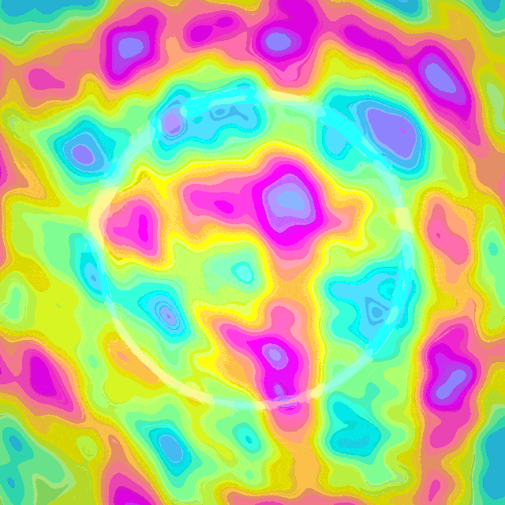<br><b>plasma_vortex</b><br>Swirling plasma, spectrum ring</td>
</tr>
<tr>
<td>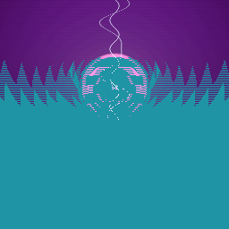<br><b>neon_grid</b><br>Retrowave grid, beat lightning</td>
<td>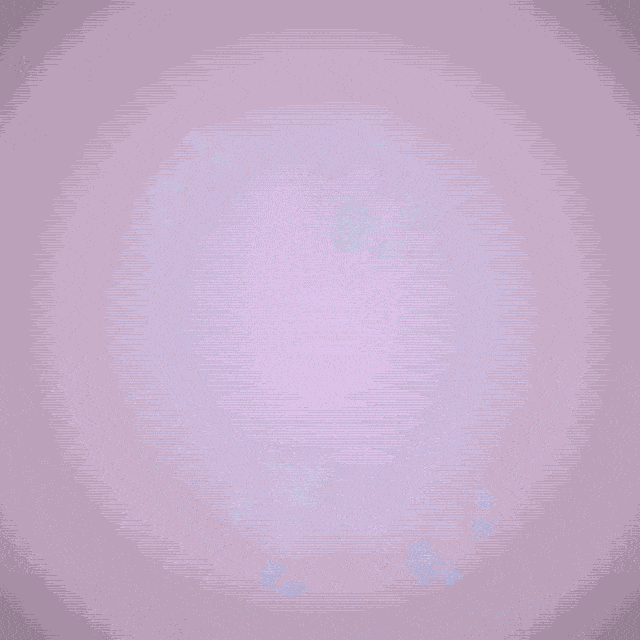<br><b>fractal_pulse</b><br>Breathing Julia set</td>
<td>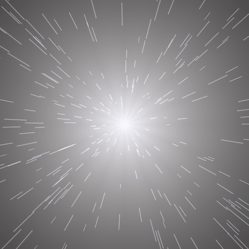<br><b>hyperdrive</b><br>Star Wars lightspeed streaks</td>
</tr>
<tr>
<td>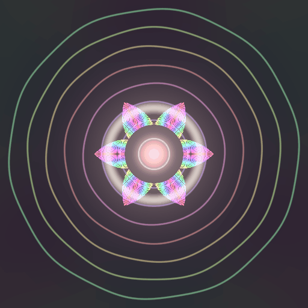<br><b>classic_viz</b><br>Winamp kaleidoscope spectrum</td>
<td>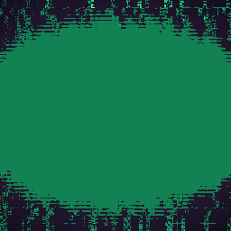<br><b>cyberpunk</b><br>Digital rain, glitch, circuits</td>
<td>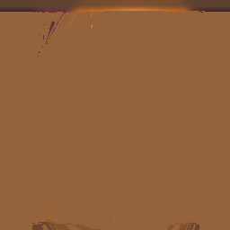<br><b>lava_lamp</b><br>Metaball blobs, autonomous</td>
</tr>
<tr>
<td>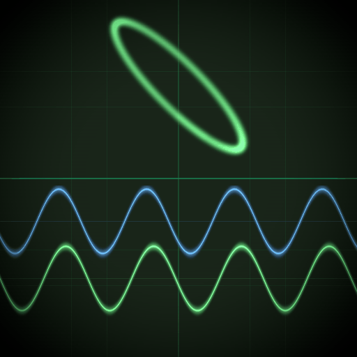<br><b>oscilloscope</b><br>Real waveform + Lissajous XY</td>
<td><br><b>cellular</b><br>Game of Life (Lua simulation)</td>
<td><br><b>gforce</b><br>G-Force feedback visualizer</td>
</tr>
<tr>
<td>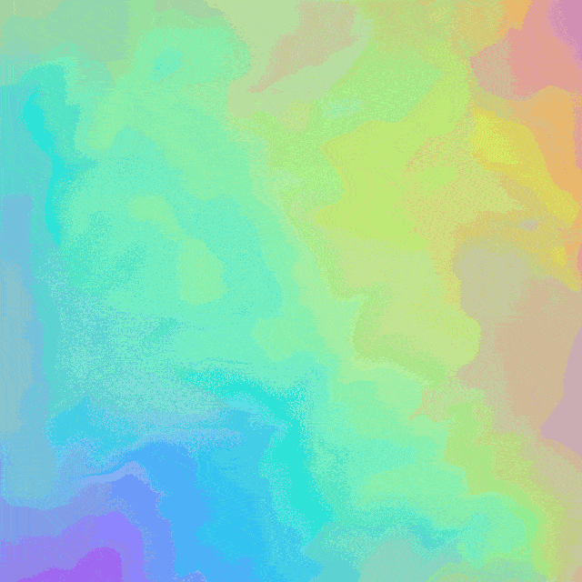<br><b>gradient_flow</b><br>ShaderGradient-style flowing mesh</td>
<td>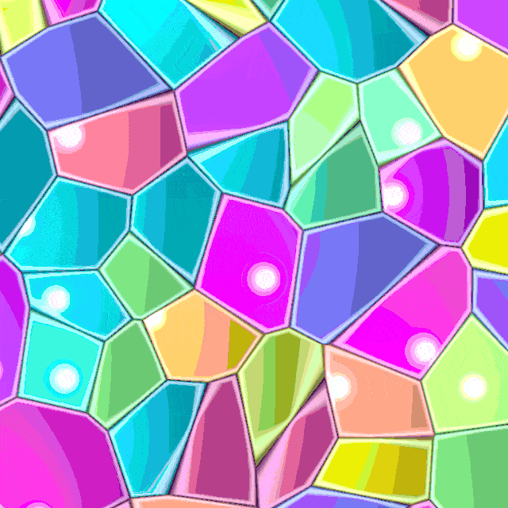<br><b>voronoi_cells</b><br>Cut-crystal stained-glass mosaic</td>
<td>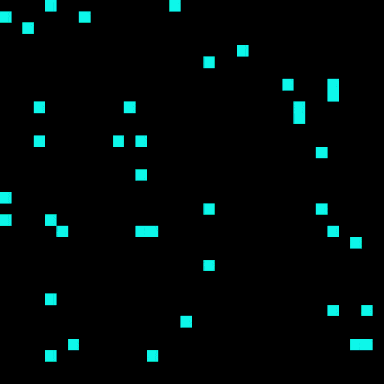<br><b>reaction_diffusion</b><br>Gray-Scott feedback growth</td>
</tr>
<tr>
<td>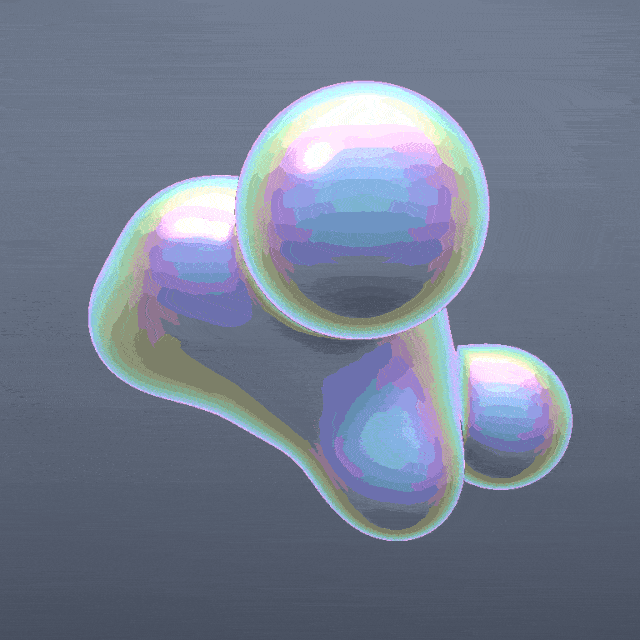<br><b>liquid_chrome</b><br>Raymarched iridescent metaballs</td>
<td>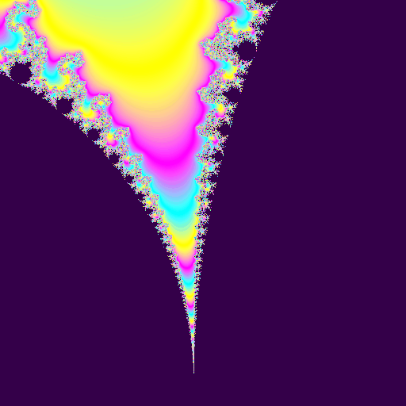<br><b>fractal_zoom</b><br>Infinite Mandelbrot dive (vs fractal_pulse's Julia)</td>
<td>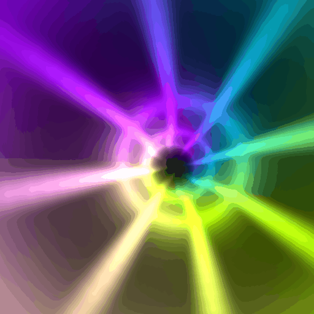<br><b>neon_tunnel</b><br>3D volumetric neon flythrough</td>
</tr>
<tr>
<td>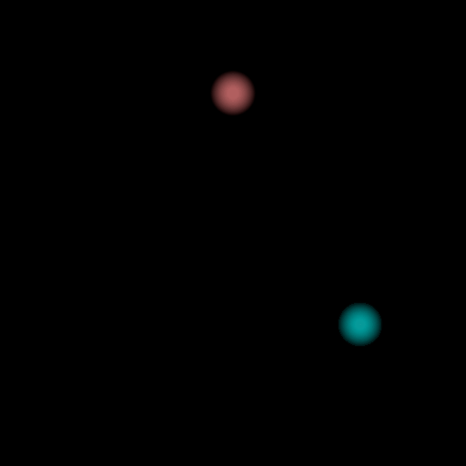<br><b>ink_flow</b><br>Curl-noise ink in water (feedback)</td>
<td>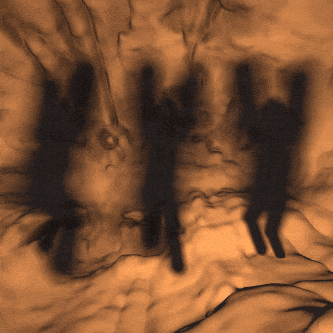<br><b>plato_rave</b><br>Unseen shape, only its shadow on the walls</td>
</tr>
</table>

## Architecture

```
                    ┌─────────────┐
                    │   Scene     │  TOML config: shaders, audio device,
                    │   Config    │  post-processing chains, grid layout
                    └──────┬──────┘
                           │
          ┌────────────────┼────────────────┐
          │                │                │
    ┌─────▼─────┐   ┌─────▼─────┐   ┌─────▼─────┐
    │   Audio   │   │  CV Input  │   │    Lua    │
    │  Pipeline │   │  MCP3008   │   │  Scripts  │
    │           │   │  over SPI  │   │           │
    │ FFT, RMS  │   │ 8 channels │   │ Per-shader│
    │ beat det  │   │ eurorack   │   │ state     │
    │ stereo    │   │            │   │ GoL, G-Force
    └─────┬─────┘   └─────┬─────┘   └─────┬─────┘
          │                │                │
          └────────────────┼────────────────┘
                           │
                    ┌──────▼──────┐
                    │   wgpu      │  Per-viewport pipeline:
                    │  Renderer   │  main shader → [post_1 → post_2 → ...]
                    │             │  Ping-pong feedback framebuffers
                    │  Uniforms   │  Composable post-processing chains
                    │  Audio buf  │
                    │  State buf  │
                    │  prev_frame │
                    └──────┬──────┘
                           │
               ┌───────────┼───────────┐
               │           │           │
          ┌────▼────┐ ┌────▼────┐ ┌────▼────┐
          │ HDMI-1  │ │ HDMI-2  │ │  Grid   │
          │ Center  │ │ Sides   │ │  NxM    │
          └─────────┘ └─────────┘ └─────────┘
```

### Inputs

- **Audio** — USB audio device (e.g. Scarlett 4i4), stereo capture with configurable channel pairs. FFT spectrum, amplitude, beat detection, bass/mid/high bands, L/R stereo analysis. Loopback support for monitoring DAW output.
- **CV** — MCP3008 ADC over SPI on Raspberry Pi. 8 channels, eurorack voltage levels normalized to 0-1. Drives shader parameters and scene triggers.
- **Keyboard** — Number keys 1-9/0 switch between scene files at runtime.

### Shader Interface

Every shader gets the same uniform buffer + audio buffer + optional state buffer:

```wgsl
// binding 0: uniforms
struct Uniforms {
    time: f32,
    delta_time: f32,
    resolution: vec2<f32>,
    amplitude: f32,
    beat: f32,
    bass: f32, mid: f32, high: f32,
    cv: array<vec4<f32>, 2>,
    scene_id: u32,
    amplitude_l: f32, amplitude_r: f32,
    bass_l: f32, bass_r: f32,
    mid_l: f32, mid_r: f32,
    high_l: f32, high_r: f32,
};

// binding 1: audio buffer [0..512) spectrum, [512..1024) waveform L, [1024..1536) waveform R
// binding 2: Lua state buffer (16384 floats, 128x128 grid)
// binding 3: sampler (for feedback)
// binding 4: prev_frame texture (previous frame's output, for feedback shaders)
```

### Composable Post-Processing

Chain post-processing shaders in TOML:

```toml
[center]
shader = "shaders/oscilloscope.wgsl"
post = ["shaders/post/flow_spiral.wgsl", "shaders/post/colormap_neon.wgsl"]
```

The pipeline runs: `main shader → flow_spiral → colormap_neon → display`. Each post shader reads the previous pass via `prev_frame`. Feedback framebuffers are auto-enabled when `post` is specified or when a shader uses `prev_frame`.

Available post shaders:
- `post/flow_spiral.wgsl` — spiral vortex distortion with trails
- `post/flow_drift.wgsl` — organic horizontal/vertical displacement
- `post/colormap_neon.wgsl` — rainbow palette cycling
- `post/colormap_fire.wgsl` — warm fire gradient
- `post/ascii.wgsl` — live ASCII-art dithering (glyph grid by brightness)
- `post/dither_bayer.wgsl` — ordered 8×8 Bayer dithering, retro low-bit banding
- `post/halftone.wgsl` — rotated CMY dot screen, print/comic look
- `post/chromatic.wgsl` — radial RGB split + onset glitch (lens/CRT)
- `post/edge_sobel.wgsl` — Sobel edge detect, neon contours on black
- `post/crt.wgsl` — CRT tube: barrel curve, aperture mask, scanlines, bloom (best placed last in a chain)
- `post/kaleidoscope.wgsl` — N-fold radial mirror, turns any source into a breathing mandala
- `post/shockwave.wgsl` — beat-drop ripple: expanding ring + zoom punch + bloom flash (needs beat/onset)
- `post/glass_shatter.wgsl` — Voronoi shards fly apart on the beat, with cracks + glints
- `post/bloom.wgsl` — soft glow / light bleed from bright areas (spiral-tap)
- `post/vhs.wgsl` — analog tape degrade: tracking jitter, chroma bleed, rolling distortion

See `scenes/touchdesigner.toml` for a grid that pairs each generator with one of these effects.

### Lua Scripting

Any shader can have a paired `.lua` file (e.g. `cellular.wgsl` + `cellular.lua`) that manages persistent CPU-side state:

```lua
function init()
    -- seed initial state, return as flat float table
    return state
end

function update(u)
    -- u.time, u.dt, u.amplitude, u.beat, u.bass, u.mid, u.high
    -- u.amplitude_l, u.amplitude_r
    -- run simulation, return updated state
    return state
end
```

The returned table is uploaded as a storage buffer (binding 2) each frame. Used by:
- **cellular.lua** — real Game of Life on 128x128 torus grid
- **gforce.lua** — G-Force preset manager (flow field + wave shape + colormap transitions)

## Scenes

```toml
[audio]
device = "Scarlett"   # match device name substring
channels = "4,5"      # stereo channel pair (4,5 = loopback on Scarlett 4i4)

[center]
shader = "shaders/hyperspace_tunnel.wgsl"

[sides]
shader = "shaders/engine_gauges.wgsl"
symmetric = true
```

Grid mode for multi-viewport layouts:

```toml
[grid_0]
shader = "shaders/hyperspace_tunnel.wgsl"
post = ["shaders/post/flow_spiral.wgsl"]

[grid_1]
shader = "shaders/gforce.wgsl"
# ... up to grid_N
```

## Usage

```sh
# Default scene (center + sides)
cargo run -- scenes/default.toml

# 5x3 grid with all shaders
cargo run -- scenes/all.toml 5x3

# Full-screen G-Force feedback visualizer
cargo run -- scenes/gforce.toml

# Composable post-processing demo
cargo run -- scenes/composed.toml

# Switch scenes at runtime with number keys 1-9/0
# Escape to quit
```

### Capture GIFs

```sh
cargo run --example capture --features capture
# Renders 60 frames of each shader at 640x640 to assets/*.gif
```

### Offline render (wav → mp4)

Render a visualizer mp4 from an audio file, driven by that audio. Runs the
real scene (main shader + post chain) in a headless offscreen loop and muxes
the original audio into the output. Requires `ffmpeg` on PATH.

```sh
cargo run --release --features render --example render -- <input.wav> <output.mp4> [scene.toml] [fps]
# Defaults: scene = scenes/composed.toml, fps = 30, resolution = 1280x720
# e.g.
cargo run --release --features render --example render -- song.wav song.mp4
```

Decodes wav via `hound` (f32 or int PCM, mono or stereo; mono is duplicated to
L/R). Each frame's audio buffer is computed from the sample window at that
frame's timestamp — FFT spectrum (log-scaled, matching `src/audio.rs`) plus the
raw L/R waveform — and uploaded to the same `[0..512)=spectrum,
[512..1024)=wave L, [1024..1536)=wave R` buffer the live engine uses. The output
mp4 contains both a video and an audio stream.

## Stack

Rust, wgpu, WGSL, winit, cpal, rustfft, mlua (Lua 5.4), rppal (Pi GPIO/SPI).

## License

AGPLv3
