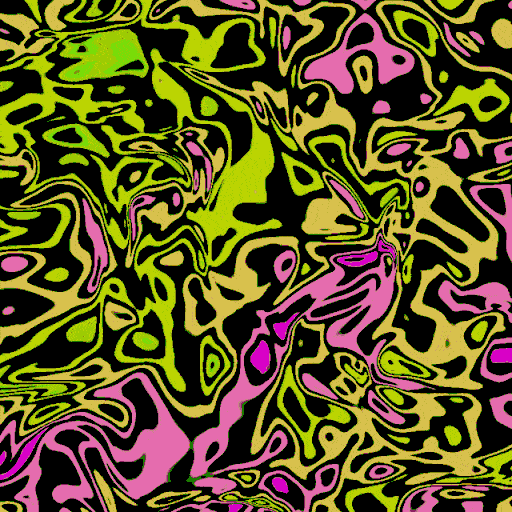
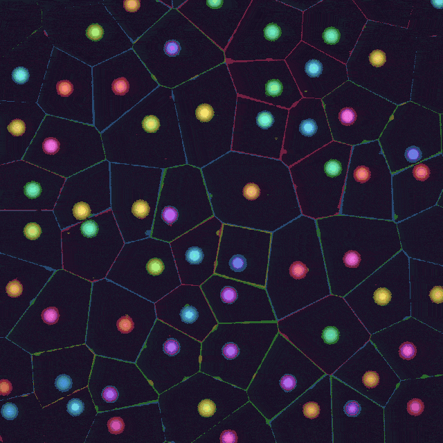
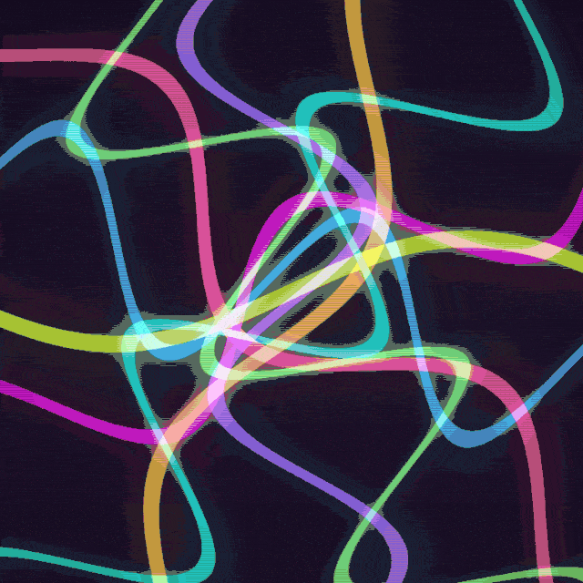
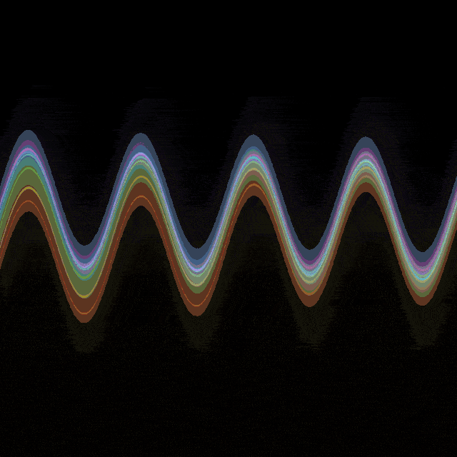
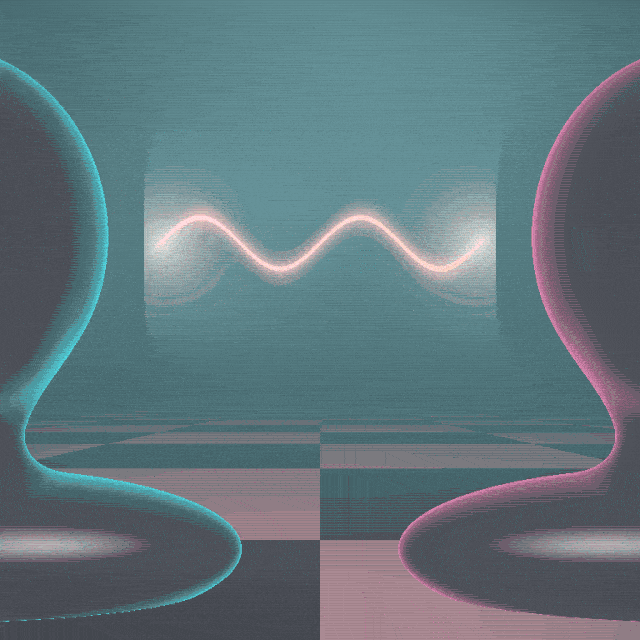
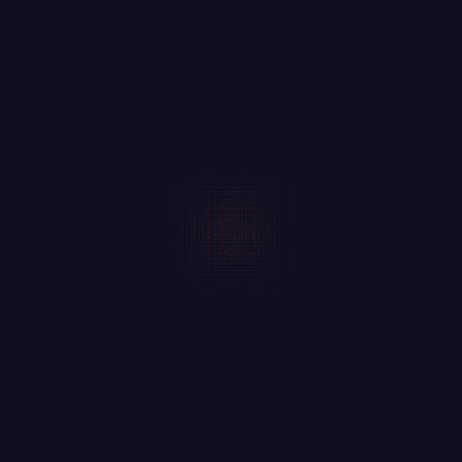

<!-- Auto-generated by: cargo run --example capture --features capture -->

<table>
<tr>
<td> <b>acid_melt</b> liquid distortion that melts the screen.</td>
<td> <b>acid_pools</b> Voronoi-based liquid pools that bubble a</td>
<td> <b>acid_worms</b> writhing tendrils of light that react to</td>
</tr>
<tr>
<td> <b>ambient_nebula</b> grows slowly with the music.</td>
<td> <b>cellular</b> displays GoL state from Lua script.</td>
<td> <b>classic_viz</b> Winamp / milkdrop-inspired visualizer.</td>
</tr>
<tr>
<td> <b>cyberpunk</b> digital rain, glitch blocks, circuit tra</td>
<td> <b>engine_gauges</b> Spectrum analyzer bars with gauge aesthe</td>
<td> <b>fractal_pulse</b> Julia set fractal that breathes with aud</td>
</tr>
<tr>
<td> <b>fractal_zoom</b> an animated Julia set that morphs, breat</td>
<td> <b>gforce</b> feedback visualizer inspired by SoundSpe</td>
<td> <b>gradient_flow</b> ShaderGradient-inspired flowing mesh gra</td>
</tr>
<tr>
<td> <b>hyperdrive</b> Star Wars lightspeed jump. Stars streak </td>
<td> <b>hyperspace_tunnel</b> </td>
<td> <b>ink_flow</b> coloured ink/dye swirling in water, a cu</td>
</tr>
<tr>
<td> <b>lava_lamp</b> soft metaball blobs that rise, merge, an</td>
<td> <b>liquid_chrome</b> raymarched metaballs with a reflective, </td>
<td> <b>neon_grid</b> retrowave infinite grid with audio-react</td>
</tr>
<tr>
<td> <b>neon_string</b> a single luminous arc that vibrates with</td>
<td> <b>neon_tunnel</b> a 3D volumetric flythrough of a glowing </td>
<td> <b>neural_link</b> two chrome mannequin busts connected by </td>
</tr>
<tr>
<td> <b>oscilloscope</b> real waveform display with green CRT pho</td>
<td> <b>plasma_vortex</b> swirling plasma tendrils that react to a</td>
<td> <b>point_cloud</b> renders video content as scattered lumin</td>
</tr>
<tr>
<td> <b>reaction_diffusion</b> Gray-Scott system, a TouchDesigner feedb</td>
<td> <b>video_player</b> displays video content from prev_frame t</td>
<td> <b>voronoi_cells</b> TouchDesigner-style animated Voronoi dia</td>
</tr>
</table>
